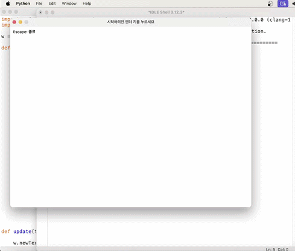
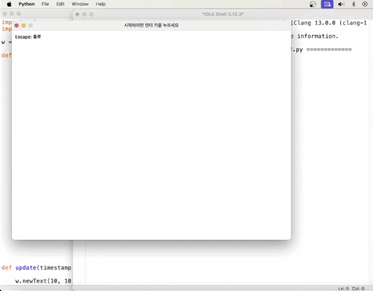

## Monster Ball Finder Game

Python으로 만든 간단한 클릭 반응 게임입니다.  
여러 공 중에서 제한 시간 안에 몬스터볼을 찾아 클릭하는 게임입니다.

## Demo

### Successful Play



### Using Cheat Key



## 게임 설명

Enter 키를 누르면 게임이 시작됩니다.

게임이 시작되면 여러 개의 공이 화면에서 무작위로 섞입니다.  
화면 상단에 **"몬스터볼을 눌러주세요!"** 라는 문구가 뜨면,  
1초 안에 몬스터볼을 찾아 클릭해야 합니다.

몬스터볼을 클릭하면 성공하고,  
다른 공을 클릭하거나 시간이 초과되면 실패합니다.

## 조작 방법

- `Enter` : 게임 시작 / 다시 시작
- `Esc` : 게임 종료
- 마우스 클릭 : 몬스터볼 선택
- `a` 또는 `q` : 치트키로 성공 처리

## 주요 기능

- 여러 공 이미지 무작위 배치
- 몬스터볼 클릭 판정
- 1초 제한 시간
- 성공 / 실패 결과 표시
- 치트키 기능
- 재시작 기능

## 실행 방법

```bash
python main.py
